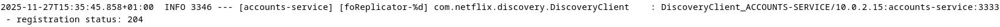
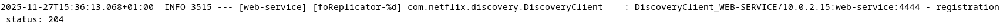
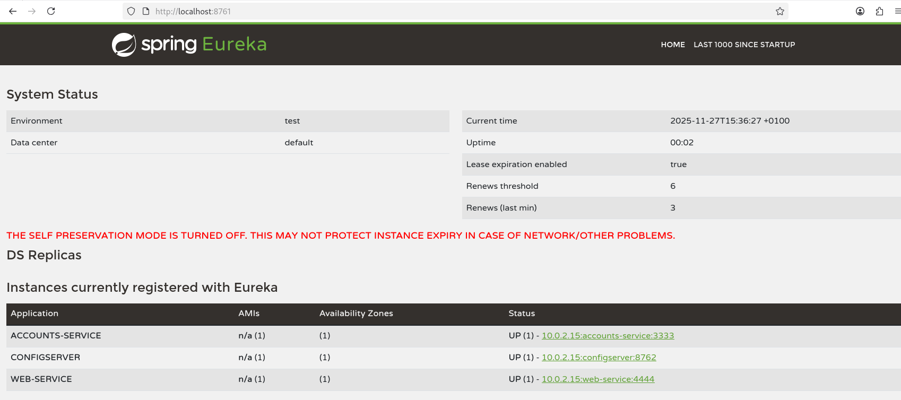
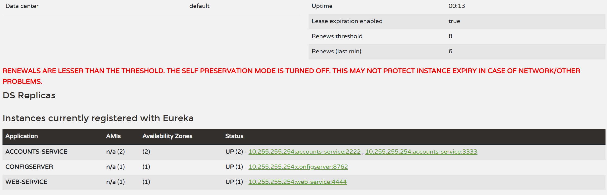
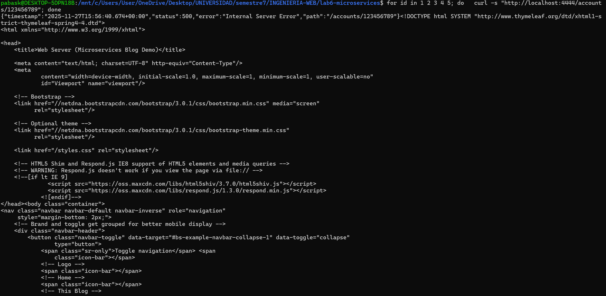
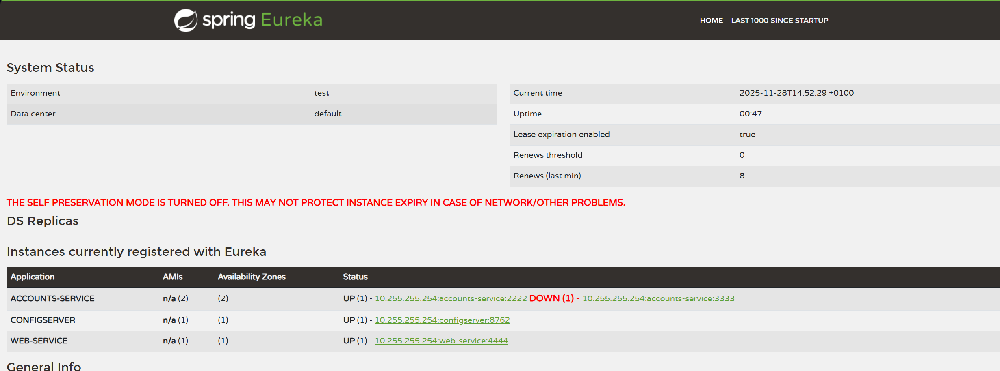
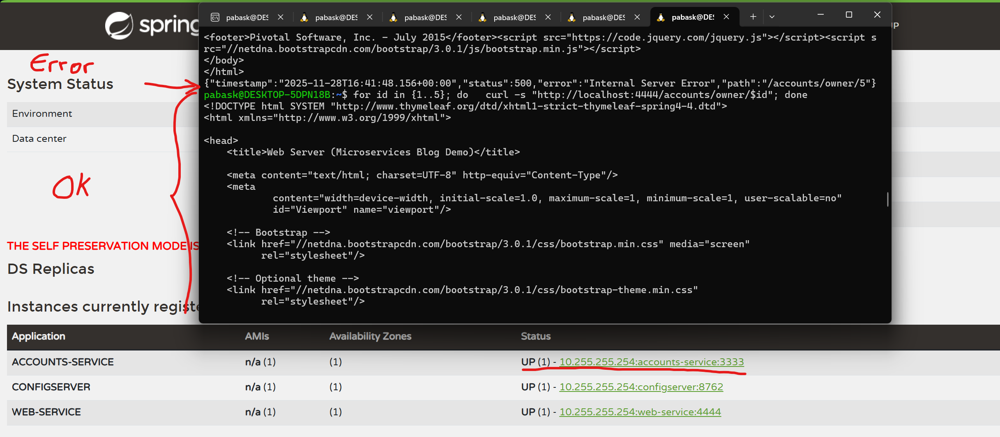

# Lab 6 Microservices - Project Report

## 1. Configuration Setup

**Configuration Repository**: https://github.com/874802/lab6-microservices

Describe the changes you made to `accounts-service.yml`:

- **What did you modify in `accounts-service.yml`?**

He modificado el archivo `config/config/accounts-service.yml` cambiando el puerto del servidor de `3333` a `2222`. Este cambio se ha realizado en la propiedad `server.port` dentro del archivo de configuración YAML. El cambio específico fue:
```yaml
server:
  port: 2222  # Cambiado de 3333 a 2222
```

Después de realizar este cambio, fue necesario reiniciar el servidor de configuración (config service) para que los cambios se propagaran correctamente a las nuevas instancias del servicio de cuentas.

- **Why is externalized configuration useful in microservices?**

La configuración externalizada es útil en microservicios por varias razones clave:

1. **Gestión Centralizada**: Permite gestionar la configuración de todos los servicios desde un único punto (Spring Cloud Config Server), evitando tener que modificar y redesplegar cada servicio individualmente.

2. **Independencia del Entorno**: La misma imagen de contenedor o JAR puede ejecutarse en diferentes entornos (desarrollo, pruebas, producción) simplemente cambiando la configuración externa, sin necesidad de recompilar el código.

3. **Cambios Dinámicos**: Es posible cambiar configuraciones sin necesidad de recompilar o redesplegar los servicios, solo reiniciándolos para que obtengan la nueva configuración del servidor central.

4. **Seguridad**: Las credenciales y datos sensibles pueden mantenerse fuera del código fuente y gestionarse de forma más segura a través del servidor de configuración.

5. **Escalabilidad**: Facilita la ejecución de múltiples instancias del mismo servicio con diferentes configuraciones según sea necesario.

---

## 2. Service Registration (Task 1)

### Accounts Service Registration



**Explain what happens during service registration:**

Durante el registro del servicio, el servicio de cuentas (Accounts Service) realiza las siguientes acciones:

1. Al iniciar, el servicio se conecta al servidor Eureka en `http://localhost:8761`
2. Envía sus metadatos al servidor Eureka, incluyendo:
   - Nombre del servicio: `ACCOUNTS-SERVICE`
   - Dirección IP y hostname
   - Puerto en el que está escuchando (3333 o 2222)
   - URL de healthcheck
3. Recibe una confirmación del servidor Eureka con código de estado HTTP 204 (No Content), que indica registro exitoso
4. Comienza a enviar heartbeats periódicos cada 30 segundos para indicar que sigue activo

El mensaje de log `DiscoveryClient_ACCOUNTS-SERVICE/... - registration status: 204` confirma que el registro fue exitoso.

### Web Service Registration



**Explain how the web service discovers the accounts service:**

El servicio web descubre el servicio de cuentas mediante el siguiente proceso:

1. El Web Service se registra a sí mismo en Eureka al iniciar, siguiendo el mismo proceso que el Accounts Service
2. El Web Service actúa como cliente de Eureka y descarga la lista de servicios registrados
3. Cuando necesita comunicarse con `ACCOUNTS-SERVICE`, consulta su caché local de Eureka para obtener las instancias disponibles
4. Utiliza un `RestTemplate` configurado con balanceo de carga del lado del cliente (client-side load balancing)
5. El `RestTemplate` resuelve automáticamente el nombre del servicio (`ACCOUNTS-SERVICE`) a una instancia específica (IP:puerto) usando la información de Eureka
6. La caché de servicios se actualiza periódicamente cada 30 segundos por defecto

Este mecanismo permite al Web Service descubrir dinámicamente las instancias de Accounts Service sin necesidad de URLs hardcodeadas.

---

## 3. Eureka Dashboard (Task 2)



**Describe what the Eureka dashboard shows:**

- **Which services are registered?**

El dashboard de Eureka muestra dos servicios registrados:
1. **ACCOUNTS-SERVICE**: El servicio backend que proporciona datos de cuentas
2. **WEB-SERVICE**: El servicio frontend que consume el servicio de cuentas

3. **CONFIG-SERVICE**: El servicio de configuración.

- **What information does Eureka track for each instance?**

Eureka rastrea la siguiente información para cada instancia registrada:

1. **Application Name**: El nombre del servicio (ej. ACCOUNTS-SERVICE)
2. **AMI ID**: Identificador de la instancia n/a(1)
3. **Availability Zones**: La zona de disponibilidad donde se ejecuta la instancia
4. **Status**: Estado actual (UP, DOWN, OUT_OF_SERVICE, UNKNOWN)

Esta información permite a Eureka y a los clientes monitorear el estado de los servicios y tomar decisiones de enrutamiento inteligentes.

---

## 4. Multiple Instances (Task 4)



**Answer the following questions:**

- **What happens when you start a second instance of the accounts service?**

Cuando se inicia una segunda instancia del servicio de cuentas:

1. La nueva instancia se inicia en el puerto 2222 (según la configuración actualizada en el Config Server)
2. La instancia se registra automáticamente en Eureka con el mismo nombre de servicio (`ACCOUNTS-SERVICE`) pero con diferente instance ID
3. Eureka ahora mantiene dos entradas para `ACCOUNTS-SERVICE`: una en el puerto 3333 y otra en el puerto 2222
4. Ambas instancias envían heartbeats independientes a Eureka
5. El Web Service puede ahora ver ambas instancias disponibles en su caché de Eureka

- **How does Eureka handle multiple instances?**

Eureka maneja múltiples instancias del mismo servicio de la siguiente manera:

1. **Registro Independiente**: Cada instancia se registra con un instance ID único, aunque compartan el mismo nombre de aplicación
2. **Lista de Instancias**: Eureka mantiene una lista de todas las instancias disponibles para cada nombre de servicio
3. **Health Tracking**: Cada instancia es monitoreada independientemente mediante heartbeats
4. **No Colisión**: Múltiples instancias del mismo servicio coexisten sin conflictos, permitiendo escalado horizontal
5. **Disponibilidad**: Si una instancia falla, las demás siguen disponibles en el registro

- **How does client-side load balancing work with multiple instances?**

El balanceo de carga del lado del cliente funciona de la siguiente manera:

1. **Obtención de Instancias**: El cliente (Web Service) obtiene la lista completa de instancias disponibles de `ACCOUNTS-SERVICE` desde su caché local de Eureka
2. **Algoritmo de Selección**: El cliente utiliza un algoritmo de balanceo (por defecto Round Robin en Spring Cloud) para seleccionar una instancia de la lista
3. **Ejecución de Petición**: La petición se envía directamente a la instancia seleccionada sin pasar por un balanceador centralizado
4. **Failover Automático**: Si una instancia no responde, el cliente puede reintentar automáticamente con otra instancia de la lista
5. **Actualización Continua**: La caché del cliente se actualiza periódicamente (cada 30 segundos) para reflejar cambios en las instancias disponibles

Esta aproximación elimina la necesidad de un balanceador de carga centralizado (single point of failure) y distribuye la lógica de balanceo entre todos los clientes.

---

## 5. Service Failure Analysis (Task 5)

### Initial Failure



**Describe what happens immediately after stopping the accounts service on port 3333:**

Inmediatamente después de detener el servicio de cuentas en el puerto 3333:

1. **Fallos Intermitentes**: Las peticiones al Web Service (http://localhost:4444) comenzaron a fallar intermitentemente. Algunos requests tuvieron éxito (los enrutados al puerto 2222) mientras que otros fallaron (los enrutados al puerto 3333 muerto).

2. **Errores de Conexión**: Las peticiones que fueron dirigidas a la instancia del puerto 3333 fallaron con errores como:
   - `Connection refused` (Conexión rechazada)
   - `java.net.ConnectException`
   - HTTP 500 Internal Server Error en el navegador

3. **Cache Desactualizada**: El problema persiste inicialmente porque:
   - La caché de Eureka del Web Service todavía lista ambas instancias como disponibles
   - El balanceador de carga sigue intentando distribuir peticiones entre ambas instancias
   - Eureka aún no ha detectado que la instancia del 3333 está caída

4. **Tiempo de Fallo**: Este comportamiento de fallo duró aproximadamente 30/60 segundos hasta que Eureka eliminó la instancia muerta del registro.

### Eureka Instance Removal



**Explain how Eureka detects and removes the failed instance:**

- **How long did it take for Eureka to remove the dead instance?**

Eureka tardó aproximadamente 60 segundos en eliminar la instancia muerta del registro. Este tiempo se divide en:

1. **Heartbeat Timeout** (~30 segundos): Eureka espera este tiempo sin recibir heartbeats de la instancia
2. **Eviction Process** (~0-60 segundos adicionales): Eureka marca la instancia como DOWN y la expulsa del registro
3. **Client Cache Refresh** (~30 segundos): El Web Service refresca su caché local y elimina la instancia muerta


- **What mechanism does Eureka use to detect failures?**

Eureka utiliza el mecanismo de **Heartbeat (Latido)** para detectar fallos:

1. **Heartbeats Periódicos**: Cada servicio registrado debe enviar un heartbeat HTTP a Eureka cada 30 segundos por defecto
2. **Lease Renewal**: Cada heartbeat renueva el "lease" (arrendamiento) de la instancia por 90 segundos adicionales
3. **Timeout Detection**: Si Eureka no recibe heartbeats durante el período de lease (90 segundos por defecto), considera que la instancia ha fallado
4. **Eviction**: Una vez expirado el lease, Eureka marca la instancia como DOWN y eventualmente la elimina del registro
5. **Self-Preservation Mode**: En modo de producción, Eureka tiene un modo de auto-preservación para evitar eliminar instancias por problemas de red temporales (deshabilitado en este lab para Windows)

Los logs de Eureka muestran mensajes como:
```
Lease expired for instance ACCOUNTS-SERVICE:...3333
Cancelled instance ACCOUNTS-SERVICE:...3333
```

Estos mensajes indican que el lease expiró y la instancia fue cancelada/eliminada del registro.

---

## 6. Service Recovery Analysis (Task 6)



**Answer the following questions:**

- **Why does the web service eventually recover?**

El servicio web se recupera automáticamente debido a la interacción de varios patrones de microservicios:

1. **Descubrimiento Dinámico de Servicios**: 
   - Eureka elimina automáticamente la instancia fallida (puerto 3333) de su registro después de detectar la ausencia de heartbeats
   - El Web Service no tiene URLs hardcodeadas, sino que confía en el registro dinámico de Eureka

2. **Actualización de Cache del Cliente**:
   - El Web Service refresca periódicamente su caché local de instancias disponibles desde Eureka (cada 30 segundos por defecto)
   - Una vez que la caché se actualiza, el Web Service solo ve la instancia saludable (puerto 2222)

3. **Balanceo de Carga del Lado del Cliente**:
   - El `RestTemplate` consciente de Eureka deja de enrutar peticiones a la instancia eliminada
   - Todas las peticiones se dirigen automáticamente a la única instancia disponible (puerto 2222)

4. **Redundancia de Instancias**:
   - Como teníamos una segunda instancia ejecutándose (puerto 2222), el servicio continuó operando
   - La arquitectura de microservicios permite que el fallo de una instancia no cause un fallo total del sistema

5. **Sin Intervención Manual**:
   - Todo el proceso de detección, eliminación y recuperación ocurre automáticamente
   - No se requiere reiniciar servicios ni reconfigurar manualmente

- **How long did recovery take?**

La recuperación total tardó aproximadamente 60 segundos desde que se detuvo la instancia hasta que todas las peticiones fueron exitosas nuevamente.

Este tiempo se compone de:
1. **Detección del Fallo** (~30-90 segundos): Tiempo para que Eureka detecte la ausencia de heartbeats y expulse la instancia
2. **Actualización de Cache** (~30 segundos): Tiempo para que el Web Service refresque su caché de instancias disponibles desde Eureka
3. **Estabilización** (~0-30 segundos): Tiempo adicional para que todas las peticiones en curso se completen y el sistema se estabilice


- **What role does client-side caching play in the recovery process?**

El caching del lado del cliente juega un papel crucial pero también introduce latencia en la recuperación:

**Rol Positivo:**
1. **Rendimiento**: La caché evita que cada petición requiera una consulta a Eureka, mejorando el rendimiento general
2. **Reducción de Carga**: Disminuye la carga en el servidor Eureka al servir instancias desde caché local
3. **Disponibilidad**: Permite que el servicio continúe funcionando incluso si Eureka tiene problemas temporales

**Rol en la Recuperación:**
1. **Retraso en la Recuperación**: La caché desactualizada es la razón por la que los fallos persisten inicialmente después de que Eureka elimina la instancia muerta
2. **Intervalo de Refresh**: El tiempo de recuperación depende directamente del intervalo de actualización de la caché (por defecto 30 segundos)
3. **Eventual Consistency**: El sistema opera bajo un modelo de consistencia eventual - hay un período donde el cliente tiene información desactualizada

**Configuración:**
El intervalo de refresh de caché puede configurarse mediante la propiedad:
```yaml
eureka:
  client:
    registryFetchIntervalSeconds: 30  # Por defecto 30 segundos
```

Un valor menor acelera la recuperación pero aumenta la carga en Eureka. Un valor mayor reduce la carga pero incrementa el tiempo de recuperación.

---

## 7. Conclusions

**Summarize what you learned about:**

- **Microservices architecture:**

He aprendido que la arquitectura de microservicios divide una aplicación en servicios pequeños, independientes y especializados que se comunican entre sí. Los conceptos clave incluyen:

1. **Independencia**: Cada servicio puede desarrollarse, desplegarse y escalarse independientemente
2. **Especialización**: Cada servicio se enfoca en una capacidad de negocio específica (ej. gestión de cuentas)
3. **Comunicación**: Los servicios se comunican a través de APIs bien definidas (REST en este caso)
4. **Descentralización**: No hay un punto central de fallo si se diseña correctamente con redundancia

- **Service discovery with Eureka:**

Eureka proporciona descubrimiento de servicios dinámico que permite:

1. **Registro Automático**: Los servicios se registran automáticamente al iniciar sin configuración manual de red
2. **Resolución de Nombres**: Los clientes pueden usar nombres lógicos de servicios en lugar de IPs y puertos hardcodeados
3. **Health Monitoring**: Eureka monitorea continuamente la salud de los servicios mediante heartbeats
4. **Escalado Dinámico**: Múltiples instancias del mismo servicio pueden registrarse y descubrirse automáticamente

El patrón de service discovery elimina la necesidad de archivos de configuración estáticos y permite que la topología de la red cambie dinámicamente.

- **System resilience and self-healing:**

El sistema demuestra resiliencia y auto-recuperación a través de:

1. **Detección Automática de Fallos**: Eureka detecta instancias fallidas mediante la ausencia de heartbeats
2. **Recuperación Sin Intervención**: El sistema se recupera automáticamente sin necesidad de intervención manual
3. **Redundancia**: Múltiples instancias aseguran que el fallo de una no cause fallo total del sistema
4. **Failover Transparente**: El balanceo de carga del lado del cliente redirige automáticamente el tráfico a instancias saludables
5. **Degradación Gradual**: El sistema puede continuar operando con capacidad reducida durante fallos parciales

Estos patrones son fundamentales para sistemas distribuidos que requieren alta disponibilidad.

- **Challenges you encountered and how you solved them:**


1. **Orden de Inicio de Servicios**: 
   - Problema: Los servicios fallaban si no se iniciaban en el orden correcto
   - Solución: Seguir estrictamente el orden Discovery → Config → Accounts → Web y esperar a que cada servicio esté completamente iniciado

2. **Tiempos de Espera**:
   - Problema: Impaciencia durante los 30-90 segundos de timeout de Eureka. Comprender los tiempos del heartbeat y eviction fue confuso al principio.
   - Solución: Entender que estos timeouts son intencionales para evitar falsos positivos


---

## 8. AI Disclosure

**Did you use AI tools?** (ChatGPT, Copilot, Claude, etc.)

**OPCIÓN A - SI USASTE AI:**
Sí, he utilizado Claude como asistente durante este laboratorio.

- **Which tools?** Claude

- **What did they help with?** 
  - Explicación de conceptos de microservicios y patrones de Eureka
  - Clarificación de los mecanismos de heartbeat y recovery

- **What did you do yourself?**
  - He ejcutado todos los servicios y realicé todas las tareas del laboratorio (Tasks 1-6)
  - He tomado todas las capturas de pantalla requeridas
  - He medido aproximadamente los tiempos de recuperación y fallos en mi propio sistema
  - He observado y analizado el comportamiento real del sistema durante las pruebas de fallo
  - He modificado los archivos de configuración según las instrucciones
  - He verificado, comprendido y aprendido las explicaciones proporcionadas por la IA comparándolas con mi experiencia práctica

**Mi comprensión personal**: 

Eureka ayuda a reunir varios servicios en una arquitectura de microservicios al proporcionar un mecanismo centralizado para el registro y descubrimiento de servicios. Los servicios se registran automáticamente al iniciar, y los clientes pueden descubrir dinámicamente las instancias disponibles sin necesidad de configuración manual. Esto facilita la escalabilidad, resiliencia y flexibilidad del sistema. Por lo que es una herramienta útil para aplicar los conocimientos aprendidos en clase 

---